# テーブル設計・ER 図（SHARE）

マイグレーション（`backend/src/database/migrations`）に基づく現在のスキーマです。

## ER 図（Mermaid）

GitHub や Mermaid 対応エディタでレンダリングできます。

```mermaid
erDiagram
    users {
        bigint id PK
        string name
        string email UK
        string password
        timestamp created_at
        timestamp updated_at
    }

    tweets {
        bigint id PK
        bigint user_id FK
        text text
        timestamp created_at
        timestamp updated_at
    }

    comments {
        bigint id PK
        bigint tweet_id FK
        bigint user_id FK
        text text
        timestamp created_at
        timestamp updated_at
    }

    likes {
        bigint id PK
        bigint tweet_id FK
        bigint user_id FK
        timestamp created_at
        timestamp updated_at
    }

    user_blocks {
        bigint id PK
        bigint user_id FK
        bigint blocked_user_id FK
        timestamp created_at
        timestamp updated_at
    }

    users ||--o{ tweets : "投稿する"
    users ||--o{ comments : "コメントする"
    users ||--o{ likes : "いいねする"
    tweets ||--o{ comments : "コメントが付く"
    tweets ||--o{ likes : "いいねが付く"
    users ||--o{ user_blocks : "ブロックする user_id"
    users ||--o{ user_blocks : "ブロックされる blocked_user_id"
```

## テーブル一覧

### `users`（ユーザー）

| カラム名 | 型 | 制約・備考 |
|----------|-----|------------|
| id | bigint unsigned | PK, auto increment |
| name | string(255) | 表示名 |
| email | string(255) | UNIQUE |
| password | string(255) | ハッシュ保存 |
| created_at / updated_at | timestamp | |

### `tweets`（つぶやき）

| カラム名 | 型 | 制約・備考 |
|----------|-----|------------|
| id | bigint unsigned | PK |
| user_id | bigint unsigned | FK → users.id, CASCADE DELETE |
| text | text | 本文 |
| created_at / updated_at | timestamp | |

### `comments`（コメント）

| カラム名 | 型 | 制約・備考 |
|----------|-----|------------|
| id | bigint unsigned | PK |
| tweet_id | bigint unsigned | FK → tweets.id, CASCADE DELETE |
| user_id | bigint unsigned | FK → users.id, CASCADE DELETE |
| text | text | 本文 |
| created_at / updated_at | timestamp | |

### `likes`（いいね）

| カラム名 | 型 | 制約・備考 |
|----------|-----|------------|
| id | bigint unsigned | PK |
| tweet_id | bigint unsigned | FK → tweets.id, CASCADE DELETE |
| user_id | bigint unsigned | FK → users.id, CASCADE DELETE |
| created_at / updated_at | timestamp | |
| （複合） | | UNIQUE(tweet_id, user_id) … 1ユーザー1ツイート1いいね |

### `user_blocks`（ユーザーブロック）

| カラム名 | 型 | 制約・備考 |
|----------|-----|------------|
| id | bigint unsigned | PK |
| user_id | bigint unsigned | FK → users.id … **ブロックした側** |
| blocked_user_id | bigint unsigned | FK → users.id … **ブロックされた側** |
| created_at / updated_at | timestamp | |
| （複合） | | UNIQUE(user_id, blocked_user_id) |
| （索引） | | INDEX(blocked_user_id) |

## 削除時の挙動（CASCADE）

- `users` 削除 → 紐づく `tweets` / `comments` / `likes` / `user_blocks`（両方の FK）が削除されます。
- `tweets` 削除 → 紐づく `comments` / `likes` が削除されます。
